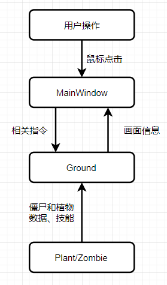
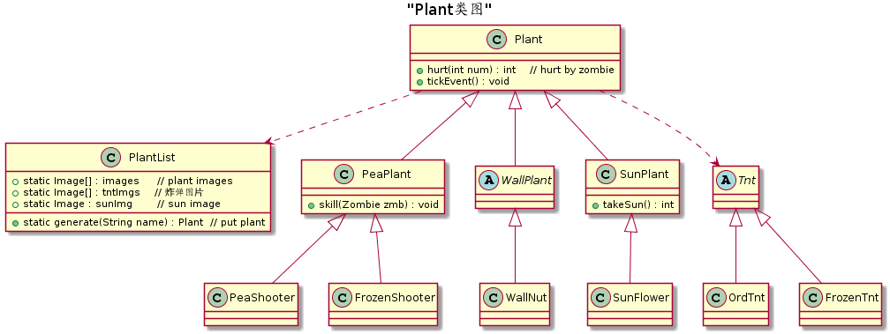

# Java大作业开发文档

《植物大战僵尸》是一款极富策略性的塔防游戏。可怕的僵尸即将入侵，每种僵尸都有不同的特点。玩家通过武装多种植物防御僵尸的进攻，快速有效地把僵尸阻挡在入侵的道路上。本实验实现了植物大战僵尸的部分功能。

项目地址：https://github.com/jcq15/plantsVSzombies

联系作者：mail.shazi@foxmail.com

<注>：

1. 涉及的图片与音频素材除背景图外都来自网络，仅为个人学习使用。
2. 由于作业尚未结束，为防止抄袭，目前github上该项目为private。

## 程序架构与原理

### 基本架构



`MainWindow`类负责用户和UI的交互。该类监听用户的鼠标动作，并作出响应。

该类包含一个内部类`Ground`，与UI层传递信息，处理游戏底层逻辑。

每隔一定的时间（50ms），`MainWindow`中的`Timer`对象会调用`Ground`类的`tick`函数。该函数先处理游戏逻辑（僵尸移动、植物攻击等），函数末尾调用`MainWindow`中的`repaint`函数，使用新的信息重新绘制图形。

### 文件组织

程序源代码涉及三个文件。

#### Plant

`Plant.java`里面是植物信息和植物附属物（子弹、阳光）。UML类图如下`Plant`类是所有植物的基类，`PlantList`类是管理所有植物的类，简单结构如下图



`PlantList`中以静态变量的形式存储了所有植物的名字和图片，这样在游戏开始时便会加载到内存，提高效率，并且便于其他地方调用相关信息。所有植物使用三层继承，基类是`Plant`，包含生命、价格等基本信息，以及时钟事件接口`tickEvent()`，受伤害接口`hurt(int)`。第二层是植物大类，目前有豌豆类、墙果类、阳光类。第三层是具体的植物。这样的架构便于后续添加双发豌豆射手、高墙果等植物。

`Tnt`及其子类是豌豆射手的炮弹。

#### Zombie

僵尸类和植物类结构类似，`ZombieList`管理所有僵尸，`Zombie`是基类，直接派生出四个子类作为四种僵尸。就不再重复了。

#### MainWindow

`MainWindow`类继承`JPanel`，包含以下内容:

- 布局信息（一些坐标值、屏幕大小）
- 游戏控制：`Timer clock` ，`Ground ground`，僵尸数量与频率，tick间隔等信息
- 构造函数与`init()`函数，初始化图形界面，添加匿名类鼠标监听器
- 重载`paintChildren()`实现画图功能
- 内部类`Ground`控制游戏逻辑

##### `Ground`类

起到控制游戏逻辑的作用。其内部类`GPlant`和`GZombie`封装了`Plant`类和`Zombie`类，并添加游戏相关信息（坐标位置、是否存活、时钟倒计时等）。

其中的`tick()`函数是核心，依次处理产生僵尸、僵尸行为（移动，吃）、植物行为（产生子弹/阳光）。以每1秒发射一个子弹为例，`GPlant`类中的`tickTime`和`tickTimeRaw`设定为1000，`MainWindow`的`Timer`对象每隔一定时间调用一次`tick()`，然后`tickTime -= 50`，若`tickTime <= 0`，调用`Plant.tickEvent()`，并执行`tickTime = tickTimeRaw`重置时钟。其他事件均以此方式实现。

## 注意事项

Java版本信息：

```shell
java version "1.8.0_181"
Java(TM) SE Runtime Environment (build 1.8.0_181-b13)
Java HotSpot(TM) 64-Bit Server VM (build 25.181-b13, mixed mode)
```

测试环境：

Microsoft Windows [版本 10.0.17134.472]

屏幕分辨率：1920*1080

**强烈建议采用同样的屏幕分辨率全屏运行游戏！**

## 亮点

- 采用面向对象编程，代码耦合性很低，便于扩展、修改
- 资源预加载，使用static块将图片、音乐等资源提前加载到内存，每次使用直接从内存中读取，避免频繁的IO操作

# todo（自己看的，交的时候别忘删了）

- 增强鲁棒性，比如输入一亿个僵尸就骂用户一顿
- 植物和僵尸的一些固定属性改成static

bug：

- 被减速之后 由于int向下取整，直接不动了
- 如果有太阳 tick就不走
